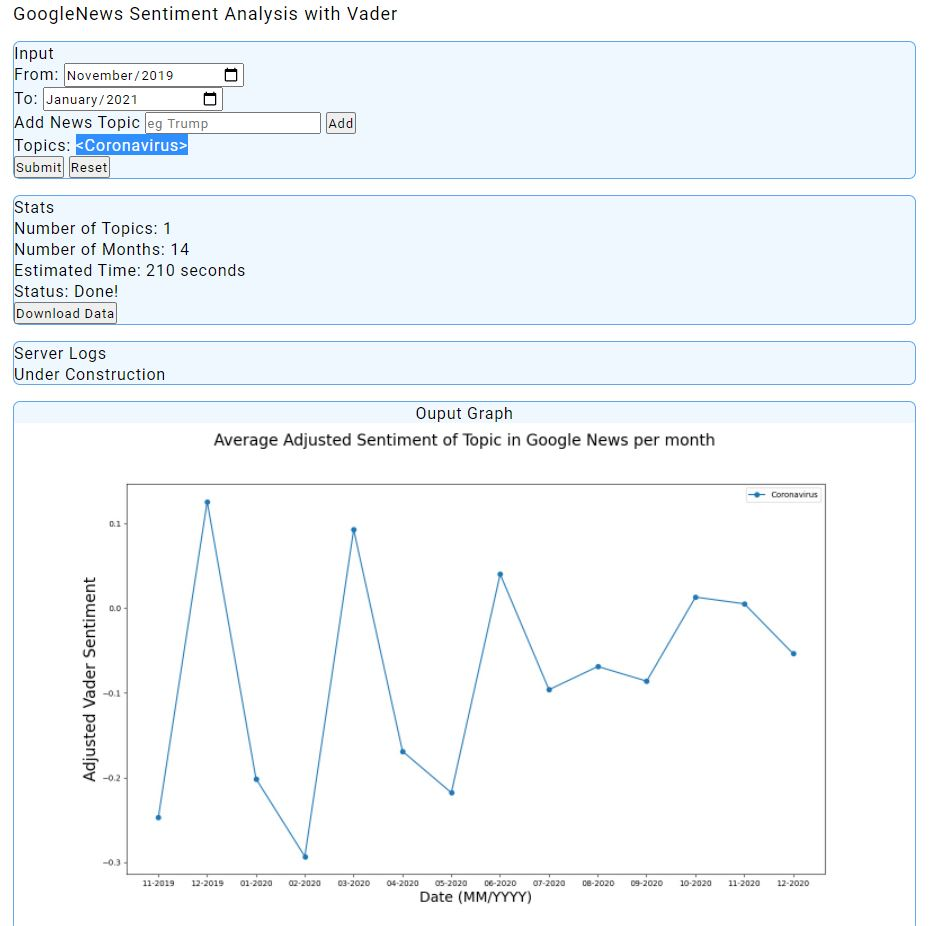
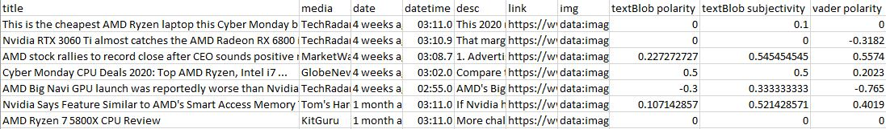

# GoogleNews Sentiment Analysis with Vader

## Summary

This project is intended to be a web app that analyses and compares the sentiment of Google News headlines based on user-defined topics and date period in MM/YYYY format. For example, given the topic 'Trump' and 'Biden' and the dates 01/2020 - 01/2021, the webapp calculates the average sentiment of GoogleNews headlines in each month and ouputs a graph along with CSV data generated per month per topic.

The aim is to capture and compare the perception of certain topics by mainstream media over a cetain time through an easy-to-use and accessible online application.

## Limitations

Currently this project is incomplete and has 2 major limitations:

- **Non-functioning server**: This project uses a flask server which was intended to be deployed online on a Platform as a Service (PaaS) like Heroku. However, because of the long time required for web scapping, background jobs and queueing operations using libraries like Redis Queue are required. As such operations are beyond my capabilities at the moment, this application will have to be used offline.

- **Imprecision of Sentiment Analysis for intended purpose**: The current program does not contextualise when given a topic. For example, when searching Google News for the topic of 'AMD', a headline such as 'Leaks Suggests AMD will destroy Intel in Performance' would be preceived as negative although the opposite is true in context. Additionally, some Vader Sentiment is sometimes unable to guage the polarity of certain headlines. Such results are excluded in the computation of the mean monthly polarity, hence decreasing sample size.

## Setup and Usage (Tested on Windows 10 only)

1. Fork Repo/Download from Github  
2. Open a terminal (eg powershell) in the directory (eg `C:\Program Files\GoogleNewsSentimentFlask-master`)
3. Activate the virtual environment by runnning `> env\scripts\activate`. Follow the steps [here](https://stackoverflow.com/questions/18713086/virtualenv-wont-activate-on-windows/18713789) if powershell is preventing the running of the script due to execution policy.
4. Run `python -m flask run` and use a browser to navigate to `localhost:5000`
5. Provide a date range, the desired topics, and click submit.

## Sample Outputs

### Coronavirus Nov 2019 - Dec 2020

Webapp Screenshot for Coronavirus

Coronavirus Graph

### AMD vs Intel vs Nvidia from Jan 2020 - Dec 2020

AMD Intel Nvidia Graph

Below is a small sample of the batch data used for calulating the average sentiment of the topic 'AMD' on November 2020 (Last column is used for caluating mean, with 0 values ignored in its computation)

### Biden vs Trump Jan 2018 - Dec 2020

## Future Plans

The hope is to deploy an online scalable version of this application background processes, instead of being limited to running it locally.
